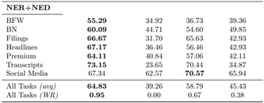

# BloombergGPT_My_Early_Commentary
BloombergGPT is said to be a revolutionary large language model bringing new quality into financial data analysis. Is it really so and what does BloombergGPT have on offer? My personal commentary on the matter.

As of October 2023, Polish language version of the commentary is available.

--------------------------------------------------------------------------

## BloombergGPT – odpowiednik ChatGPT dla sektora finansowego? 

Zapraszam do przeczytania mojej wypowiedzi na ten temat.
Marta Mężykowska, 08.10.2023 r.

-----------------------------------------------------------------------

## Spis treści
   * [Generatywna sztuczna inteligencja](#Generatywna-sztuczna-inteligencja)
   * [BloombergGPT AI w służbie świata finansów](#BloombergGPT-AI-w-służbie-świata-finansów)
   * [BloombergGPT metodologia modelu](#BloombergGPT-metodologia-modelu)
   * [BloombergGPT omówienie wyników](#BloombergGPT-omówienie-wyników)
   * [BloombergGPT podsumowanie i niuanse](#BloombergGPT-podsumowanie-i-niuanse)
   * [Bibliografia](#Bibliografia)

-------------------------------------------------------------------

## Generatywna sztuczna inteligencja

  W ostatnim czasie newsfeedy zostały wprost zalane informacjami na temat ChatGPT – chatbota opartego na sztucznej inteligencji, który został udostępniony przez firmę OpenAI bezpłatnie dla każdego zalogowanego uczestnika. Do tej pory wydawało się, iż korzystanie z osiągnięć sztucznej inteligencji możliwe jest jedynie dla wąskiego i wyspecjalizowanego grona osób, tymczasem ChatGPT uzmysłowił przeciętnemu             użytkownikowi Internetu potencjał, jaki kryje się w wykorzystaniu modeli opartych na AI (tzw. LLM-ów*) do zadań z zakresu pogłębionej analizy tekstu, generowania spersonalizowanych treści i wyszukiwań.  Choć     ChatGPT nie jest nieomylny, a także trzeba wiedzieć w jaki sposób z nim rozmawiać, aby uzyskać wartościową i najlepiej dopasowaną do oczekiwań odbiorcy odpowiedź,  nie ulega wątpliwości, iż odniósł niesamowity sukces i optymalizuje ludzką pracę w wielu dziedzinach.

  (*LLM – ang. „Large Language Model” – dosłownie „Duży model językowy” - model językowy oparty na sztucznej inteligencji, trenowany na ogromnych zbiorach danych i osiągający wysoką w porównaniu z innymi modelami skuteczność. Zasadniczo stworzenie takiego modelu uczenia maszynowego wymaga udostępnienia ogromnej mocy obliczeniowej i jego wieloetapowego treningu, przez co jest to osiągalne praktycznie tylko dla\lub we współpracy z wiodącymi firmami technologicznymi.)

  Funkcjonalności, których oczekiwać można od ChatGPT to przede wszystkim odpowiadanie przez bota na zadane pytania. Chatbot będzie generował odpowiedź dla użytkownika, jeśli zajdzie taka potrzeba może także dane „w tle” przetwarzać, podsumowywać czy przeredagowywać, tak by przedstawić finalny efekt zgodnie z oczekiwaniem rozmówcy. Możemy zasugerować mu formę czy długość odpowiedzi, możemy także poprosić o wygenerowanie raportu, prezentacji czy dokumentu na konkretny temat. Na dzień dzisiejszy kwestie praw autorskich do wygenerowanych przez bota odpowiedzi w większości krajów są jeszcze nieuregulowane, choć zdarzały się już pierwsze procesy sądowe na ten temat.   

  Lawinowo rosnące zainteresowanie modelami sztucznej inteligencji postanowili wykorzystać inni giganci technologiczni prezentując swoje osiągnięcia w tej dziedzinie. Dużo emocji wywołuje chatbot Bard od Google, bezpośrednia konkurencja dla ChatGPT w sektorze generatywnej sztucznej inteligencji ogólnego przeznaczenia. Kolejne rozwiązania prezentują także firmy takie jak Microsoft, Meta czy NVIDIA.

-------------------------------------------------------------------

## BloombergGPT AI w służbie świata finansów

  Tymczasem obok starcia na szczycie, nieco w cieniu, dzieją się równie ciekawe rzeczy. A mianowicie powstają wyspecjalizowane modele językowe, oparte na sztucznej inteligencji, dostosowane dla konkretnych branż i odbiorców. Czy możemy jednak liczyć na dokładne odwzorowanie modelu biznesowego firm pokroju OpenAI czy Google w tym zakresie? O tym poniżej.

  30 marca 2023 r., a więc dokładnie 4 miesiące po tym jak OpenAI upubliczniło dostęp do ChatGPT, międzynarodowa agencja prasowa Bloomberg L.P. ogłosiła pierwsze szczegółowe informacje na temat BloombergGPT - rozwijanego przez siebie modelu językowego opartego na sztucznej inteligencji dedykowanego środowisku finansowemu. BloombergGPT ma radzić sobie znacznie lepiej z zapytaniami z zakresu finansów wśród modeli uczenia maszynowego o podobnej wielkości. Z udostępnionych przez firmę informacji możemy dowiedzieć się także, iż BloombergGPT jest wyczulony na uwzględnienie specyficznego kontekstu informacji widzianego z perspektywy świata finansów. Wśród innych zapewnień firma posuwa się także do stwierdzenia, iż BloombergGPT radzi sobie tylko niewiele gorzej, o ile wcale, z odpowiedziami na pytania „general purpose”, czyli ogólnego przeznaczenia, w których prym wiodą duże modele językowe pokroju ChatGPT czy Bard.

  Zanim przejdziemy jednak do szczegółowych analiz, poświęćmy chwilę firmie Bloomberg L.P. samej w sobie. Siedziba firmy znajduje się na Manhattanie w Nowym Jorku w USA, a jej korzenie sięgają 1981 roku. Bloomberg znany jest przede wszystkim jako jeden z największych i najbardziej wpływowych prywatnych serwisów informacyjnych na świecie, dostarczający codziennie informacje na temat spraw bieżących, ekonomii, finansów, polityki, technologii i innych. Firma świadczy także szeroko pojęte usługi z zakresu finansów, technologii i analizy danych. Bloomberg jest aktywny w mediach konwencjonalnych, jak i społecznościowych, publikuje branżowe raporty i statystyki, a także posiada zintegrowane narzędzie  dedykowane inwestorom indywidualnym i korporacyjnym zwane Bloomberg Terminal. (Za podobny w pewnym sensie, aczkolwiek lokalny polski odpowiednik serwisu informacyjnego Bloomberg można podać serwis bankier.pl. )

  Czym dokładnie jest Bloomberg Terminal? Jest to narzędzie stworzone z myślą o inwestorach giełdowych oraz interesariuszach szeroko pojętego sektora finansów. Bloomberg Terminal to portal internetowy umożliwiający dostęp w jednym miejscu oraz w czasie rzeczywistym do danych finansowych pochodzących z oficjalnych publikacji podmiotów prywatnych i instytucji rządowych z całego świata, jak i wykonanych na ich podstawie przez program własnych raportów i analiz finansowych czy ocen ryzyka. Bloomberg Terminal może posłużyć nie tylko do wyszukania konkretnej firmy i jej profilu finansowego, dostarczy informacji o jej strukturze kapitału, akcjonariacie, wynikach na giełdzie czy ogólnej ocenie ryzyka inwestycyjnego, wszystko w ujęciu czasowym. Patrzeć na dane możemy także z makroekonomicznego punktu widzenia:  znajdziemy tu informacje w podziale na sektory gospodarcze, kraje, rynki, giełdy, indeksy czy poszczególne typy instrumentów finansowych. Dodatkowo terminal posiada także zintegrowany news feed oraz umożliwia bezpośrednie inwestowanie (zakup instrumentów finansowych). Można by powiedzieć, wszystko dla inwestora w jednym miejscu.

  Pozostaje pytanie: jaką wartość dodaną może wnieść BloombergGPT do Blommberg Terminal? Uogólniając, można by powiedzieć, iż Bloomberg Terminal jest solidną bazą wiedzy na temat zjawisk w obrębie sektora finansów, natomiast BloombergGPT ma być „silnikiem”, który po podpięciu do danych umożliwi ich szybszą, efektywniejszą i bardziej kompleksową analizę. Dokładnie tak jak w przypadku ChatGPT, narzędzie Bloomberga powinno pozwolić na szybkie i skuteczne wyszukiwanie oraz generowanie spersonalizowanych treści na indywidualne zapytania. Byłoby to szczególnie przydatne w przypadku, gdyby odpowiedź wymagała korzystania z więcej niż jednego źródła, podsumowania czy pogrupowania danych lub przygotowania prostej wizualizacji. 

  BloombergGPT ma integrować funkcjonalności charakterystyczne dla  modeli uczenia maszynowego z zakresu NLP (NLP – ang. „Natural Language Processing” – „przetwarzanie języka naturalnego”, znacznie upraszczając, jest to ogół procesów prowadzących do generowania przez maszynę tekstu wartościowego i zrozumiałego dla człowieka). W tym rozumieniu firma Bloomberg wskazuje na skuteczne zastosowanie BloombergGPT m.in. do klasyfikacji wiadomości (newsów), rozpoznawania encji (NER) czy analizy sentymentu. Poświęcę tutaj chwilę każdej z tych kategorii.

  Klasyfikacja jest szerokim tematem w ujęciu uczenia maszynowego (ang. “Machine learning”), a jej celem jest poprawne przypisanie obiektu do odpowiedniej kategorii (klasy). Klasyfikacja binarna dopuszcza dwie klasy: mogą być to na przykład prawda i fałsz, oznaczające spełnienie warunku klasyfikacji lub jego niespełnienie. Możemy podzielić firmy na publiczne lub prywatne, notowane na giełdzie lub nie, kandydatów na pracowników na karanych lub o nienagannej przeszłości. Inny rodzaj klasyfikacji to wieloklasowa: jak łatwo się domyślić, potencjalnych kategorii przypisania jest tu więcej. Przykładem może być unijna klasyfikacja przedsiębiorstw na mikro, małe, średnie i duże przedsiębiorstwa.  

  W zależności od klasyfikatora możemy starać się przypisywać wiadomości do odpowiednich kategorii tematycznych (autotagowanie), ustawiać alerty (ważne-nieważne, pilne-niepilne itp.), odfiltrowywać spam, podpowiadać powiązane treści, podzielić klientów na kategorie. Odpowiednie zaklasyfikowanie informacji jest wstępnym krokiem pozwalającym na wysoką efektywność przetwarzania informacji.  

  Kolejnym aspektem wartym wyjaśnienia jest rozpoznawanie encji (z ang. NER – „Named Entity Recognition”). Za encję uznaje się określony obiekt, możliwy do wyróżnienia na tle innych obiektów w tekście. Przykładami encji w tekście mogą być podmiot lub osoba (LPP SA, Andrzej Duda), miejsce (Gdańsk), rzecz (Fiat 126p), ale także podjęcia niematerialne i abstrakcyjne (wojna, konto bankowe, hasło np. ostry cień mgły). W tekście oznaczać można więcej niż jedną encję, a relacje je łączące mogą tworzyć swoiste „siatki zależności”, które także mogą być poddawane analizie. 

  Analiza encji jest dla człowieka bardzo intuicyjna. Słuchając wiadomości, czytając newsy czy informacje ze świata social mediów bez problemu identyfikujemy obiekty o specyficznym znaczeniu. Algorytmy uczenia maszynowego muszą jednak nauczyć się analizy tekstu z ujęciem specyficznego kontekstu w jakim słowo jest osadzone, języka o konkretnej składni oraz poruszania w złożonym świecie wyrazów wieloznacznych. Poprawne oznaczanie encji jest kluczowe dla skutecznego działania wyszukiwarek i znajdowania właściwych odpowiedzi na zadane przez użytkowników pytania.

  Ważnym zagadnieniem z dziedziny NLP jest analiza sentymentu (ang. „Sentiment Analysis”). Analiza sentymentu jest analizą tekstu (np. wypowiedzi, artykułu prasowego) służącą określeniu zaangażowania emocjonalnego autora oraz potencjalnego efektu wywołanego u odbiorcy. Jeśli pani Kowalska przeczyta w Internecie negatywny komentarz napisany przez pana Nowaka na temat frytek z McDonalda, zgodnie z analizą sentymentu możemy wywnioskować, iż a) pan Nowak ma negatywny sentyment wobec frytek z McDonalda, b) pani Kowalska może nie zakupić tych frytek kierując się negatywną opinią pana Nowaka. Wbrew pozorom analiza sentymentu nie jest niczym nowym, najprostszym jej przykładem są różnego rodzaju sondaże przeprowadzane w okresie przedwyborczym czy badania opinii konsumentów. Z perspektywy przedsiębiorstwa czy instytucji, poznanie sentymentu na temat firmy, oferowanych produktów czy usług, czołowych pracowników, działań społeczno-politycznych czy oczekiwań interesariuszy może okazać się kluczowe dla kreowania wizerunku, działań marketingowych, biznesowych sojuszy zawieranych przez firmę czy finalnego efektu w postaci wolumenu sprzedaży produktów i usług.  Co więcej, wczesne (wcześniejsze niż konkurencja) rozpoznanie trendów, zmian i nastrojów może być znaczącą przewagą rynkową  dla przedsiębiorstwa. Stąd też korzyści z zastosowania analizy sentymentu mogą być dla firm ogromne.

  W odniesieniu do modeli językowych opartych na sztucznej inteligencji, analiza sentymentu podmiotu z otoczenia finansowego mogłaby polegać na analizie wiadomości, oczekiwań i reakcji dotyczących wprowadzenia nowego produktu czy usługi, wyników okresowych i giełdowych, dywidendy, otoczenia rynkowego (jak firma odnajduje się w bieżącej sytuacji rynkowej?), odbioru komunikatów stosowanych przez firmę do interesariuszy i innych informacji z nią związanych. Nie bez znaczenia jest tutaj aspekt czasowy - dane w postaci newsów mogą być analizowane natychmiast po zdarzeniu, dostarczają więc szybkiego i kompleksowego feedbacku na temat odbioru sytuacji przez publikę oraz umożliwiają dostosowanie polityki informacyjnej podmiotu pod bieżące zapotrzebowanie i oczekiwania.

  W swojej publikacji „BloombergGPT: A Large Language Model for Finance” z 30.03.2023 r.  (wersja zaktualizowana 09.05.2023 r.; dalej będę odnosić się do niej jako ‘Paper’) na stronie 19 Bloomberg posuwa się do przedstawienia jeszcze śmielszego przykładu, w którym wskazuje na przewagi konkurencyjne BloombergGPT w zakresie analizy sentymentu. Firma stwierdza, iż jej model jest w stanie znacząco lepiej odczytywać sentyment z wiadomości o tematyce finansowej z punktu widzenia potencjalnego inwestora niż inne LLMy. Aby to zobrazować posłużono się następującym przykładem: w Sieci pojawia się wiadomość prasowa „Firma XYZ zwolni 10 000 pracowników”. Z punktu widzenia szerokiego grona odbiorców taka informacja wzbudzi negatywny sentyment (ludzie tracący pracę pozostają bez środków do życia, redukcja etatów popularnie kojarzona z ograniczeniem nierentownej działalności = kłopoty w biznesie). BloombergGPT natomiast, stawiając się w pozycji inwestora, mógłby taką wiadomość w określonych przypadkach oznaczyć jako wywołującą sentyment pozytywny – np. gdyby sprzedaż nierentownej i nierokującej części działalności miała poprawić płynność finansową firmy XYZ oraz wzmocnić jej pozycję na rynku i koncentrację kompetencji w segmentach strategicznych, co stanowiłoby pozytywny sygnał do generowania przyszłych zysków. Brzmi ciekawie?

-------------------------------------------------------------------

## BloombergGPT metodologia modelu

  W publikacji (Paper, od str. 11) możemy dowiedzieć się wielu szczegółów na temat założeń i metodologii towarzyszących tworzeniu modelu BloombergGPT.  Kilka najważniejszych przedstawiam poniżej.

  BloombergGPT jest modelem zbudowanym na architekturze transformerów, a jego  bezpośrednim „rodzicem” jest dostępny publicznie LLM „BLOOM” (https://huggingface.co/docs/transformers/model_doc/bloom#transformers.BloomModel). 
  
  Model BloombergGPT posiada  50 mld parametrów oraz ponad 700 mld tokenów (aczkolwiek finalna wersja modelu zdołała przeprocesować w procesie uczenia modelu 570 z 710 mld dostępnych tokenów, nie wykorzystując zatem wszystkich przygotowanych zasobów).   

  Tokenizacja w ujęciu machine learningowym oznacza podział analizowanego tekstu na tzw. tokeny, którymi mogą być zdania, słowa, części słów, cyfry. Algorytmy  potrzebują rozłożyć tekst na „czynniki pierwsze”, by następnie móc efektywniej przeprowadzać na nim kolejne operacje i wyciągać wnioski. Dla naszej „maszyny” nie ma takiego znaczenia wolumen obrabianego tekstu, a to, ile finalnie tokenów do analizy z niego otrzymamy. Duża liczba tokenów przemawia na korzyść analizowanego modelu.

  Ciekawym niuansem są dane treningowe, które posłużyły do wyuczenia modelu BloombergGPT (ang. „training data”). Firma Bloomberg w swoim komunikacie prasowym dotyczącym publikacji wyraźnie podkreślała znaczenie „wysoce jakościowego i wyspecjalizowanego” wsadu danych do trenowania modelu. Dane pochodziły ze źródeł własnych przedsiębiorstwa, zbieranych przez 40 lat jego pracy lub z danych zewnętrznych (dostępnych publicznie). W przypadku tych drugich, zdecydowano się na uwzględnienie jedynie tych zweryfikowanych i wstępnie przeprocesowanych pod wymagania uczenia maszynowego. 
  
  Pokrótce (szczegóły Paper, str. 5-6):
  * Dane własne, w tym serwis Bloomberg (język angielski) – 77% dokumentów, finalnie 51% tokenów = 363 mld tokenów,
  *	Dane publiczne (język angielski) – 23% dokumentów,  finalnie 49% tokenów = 345 mld tokenów.

 
  W skład danych publicznych (open source), na których trenowany został model, wybrane zostały dwa duże publiczne data sety, zwane The Pile oraz C4. Zostały one wstępnie przeprocesowane i oczyszczone przez swoich autorów, dzięki czemu są chętnie używane do uczenia nowych LLM-ów. Dodatkowo w dane publiczne włączono także świeże, nieoczyszczone dane z Wikipedii (od 1 lipca 2022 r., starsza wersja Wikipedii była już częścią The Pile oraz C4).

  Jako dane własne Bloomberg deklaruje przygotowany przez siebie zbiór danych FinPile. Jednakże pewnym zaskoczeniem jest, iż większość jego treści… dostępna jest publicznie w Internecie w formie artykułów prasowych czy notatek social media. Tylko niewielka część FinPile (poniżej 1%) to stricte finansowe dokumenty zastrzeżone przez Bloomberga, jakimi mogłyby być przykładowo pełne sprawozdania finansowe firm i spółek zależnych, raporty finansowe, analizy konsultingowe, dokumentacja wewnętrzna dotycząca fuzji i przejęć, związana z wejściem na giełdę i inne. Możnaby się spodziewać, iż udział takich danych w trenowaniu modelu będzie znacznie większy, ponieważ wydaje się, iż wokół nich firma Bloomberg chce budować swoją przewagę konkurencyjną. Tymczasem okazuje się, iż próg wejścia w specjalizację finansową dla innych modeli może nie być aż tak wysoki, skoro zdecydowana większość danych jest ogólnodostępna do pobrania w Internecie. W związku z powyższym należy też mieć świadomość, iż specjalizacja finansowa modelu BloombergGPT będzie prawdopodobnie dawała najlepsze efekty w analizach krótkich artykułów prasowych i notatek social media. Nie wiadomo, czy tak samo dobrze model radziłby sobie z analizą wielostronicowych i wielowątkowych dokumentów finansowych. Stąd też nasuwa się ciekawe pytanie, czy w przypadku takiej dokumentacji BloombergGPT “wygrałby” z innymi niewyspecjalizowanymi modelami, takimi jaki ChatGPT czy Bard, o których wiemy, że są w stanie sprostać takim wymaganiom? 

  Warto też wspomnieć, iż FinPile ani żadna jego część nie zostały udostępnione przez Bloomberga publicznie. Oczywiście przygotowanie zbioru danych pod uczenie maszynowe nie polega tylko i wyłącznie na zebraniu danych; dane te są także wstępnie przeprocesowane, oczyszczane i otagowane, kosztuje to czas i środki. Mimo to pojawiły się głosy ze środowiska, iż skoro firma chętnie korzysta dla własnych celów z cudzych opracowań (jak wcześniej wspomniane The Pile oraz C4), mogłaby dorzucić swoją cegiełkę do rozwoju branży zamiast być wyłącznie jej beneficjentem. 

  Przyjrzyjmy się teraz stosunkowi danych własnych do publicznych. Pierwsze co nasuwa się na myśl, to o ile faktycznie pod względem ilości dokumentów użytych do trenowania modelu dane własne w posiadaniu firmy Bloomberg (FinPile) znacząco przeważają, to już pod względem finalnego efektu tokenizacji otrzymujemy stosunek tokenów własnych do publicznych praktycznie 1:1. Co to oznacza w praktyce? Wydaje się, iż firmie Bloomberg zależało, aby BloombergGPT uzyskał dobre wyniki w domenie finansowej, w tym “nauczył się” korzystać z własnych zbiorów danych, ale także umiał pracować z różnorodnymi zagadnieniami i mógł być poddany ocenie na równi z innymi modelami językowymi.   

  Nie sposób nie wspomnieć o doborze konkurencyjnych modeli do analizy wyników BloombergGPT. Firma Bloomberg precyzuje, iż za kluczowe parametry w wyborze modeli do analizy porównawczej uznała: rozmiar modelu, typ analizowanych przez model danych (ang. „training data”), ogólną skuteczność modelu oraz jego dostępność (Paper, str. 17). Na ostatni parametr położono szczególny nacisk wspominając, iż model GPT-3 (pierwowzór na którym zbudowany został ChatGPT) nie był w danym czasie w pełni dostępny, a jedynie możliwe było wykorzystanie części z jego upublicznionych wyników jako dodatkowy punkt odniesienia. 

  Na tej podstawie do analizy porównawczej BloombergGPT (50 mld parametrów) dobrano następujące LLMy oraz podano krótkie uzasadnienia tych wyborów (Paper, str. 17):  
  * GPT-NeoX (20 mld parametrów) - model o najlepszych rezultatach wśród modeli do 50 mld parametrów,  
  * OPT (66 mld parametrów) - rozmiar i struktura obu modeli jest podobna, 
  * Bloom (176 mld parametrów) - model jest znacznie większy oraz został trenowany na danych w różnych językach, ale architektura obu modeli i oprogramowanie wspierające działanie modelu (tzw. “stack technologiczny”) są podobne. Warto tu ponownie wspomnieć, iż BloombergGPT powstał w oparciu o model Bloom. 

  Firma dodała także, iż „gdzie jest to możliwe odnosi wyniki także do modelu GPT-3”, ale zdarza się to wybiórczo. Pod względem liczby parametrów GPT-3 przewyższa BloombergGPT ponad 3-krotnie - jest znacznie większym modelem, porównywalnym do modelu Bloom. Jednakże ChatGPT wydaje się być obecnie najbardziej popularnym wśród konsumentów LLMem, stąd też porównywalne lub lepsze wyniki BloombergGPT byłyby znaczącą informacją dla zainteresowanych odbiorców, iż jest warty zaufania. Dodatkowo, w publikacji (Paper), która ukazała się już po upublicznieniu dostępu do ChatGPT, pada stwierdzenie, iż BloombergGPT w wielu zagadnieniach nie ustępuje modelowi GPT3, warto byłoby więc mieć do tego pełną skalę porównawczą. Ciężko rozstrzygnąć, czy pełne porównanie obu modeli rzeczywiście nie było możliwe, czy firma Bloomberg miała obiekcje do udostępnienia swoich danych, aby to porównanie przeprowadzić, czy też nie wszędzie podawanie wyników byłoby po prostu wygodne.  

-------------------------------------------------------------------

## BloombergGPT omówienie wyników

  Analizę skuteczności działania modelu podzielono na kilka części (start: Paper, str. 20). W kilku słowach omówię wyniki w każdej z kategorii, zachowując strukturę charakterystyczną dla oryginalnego dokumentu.
  
  W publikacji do ewaluacji modeli użyto następujących wskaźników (metryk): F1 score (kategorie 1-4), Accuracy (kategorie 5-7). 

  Accuracy, po polsku “dokładność”, to metryka pokazująca ilość poprawnie zaklasyfikowanych przez model informacji względem wszystkich prób klasyfikacji (poprawnych i niepoprawnych). Przykładowo, możemy modelowi zadać pytanie: w ilu przypadkach na 100 prób model poprawnie rozpozna, iż dana informacja odnosi się do Andrzeja Dudy, prezydenta Polski (a nie np. firmy Duda, producenta wędlin, firmy kosmetologicznej dr Duda lub innego podmiotu o zbieżnej nazwie) oraz analogicznie w ilu przypadkach model poprawnie rozpoznał, iż dana informacja NIE dotyczy prezydenta Dudy, a innego podmiotu?  W ogólnym rozrachunku im wyższy wynik, tym lepszy model, chociaż miara ta ma także swoje wady, które mogą ujawnić się w określonych warunkach.  

  F1 score to kompleksowy wskaźnik, który łączy w sobie uśrednione informacje na temat precyzji i czułości modelu. Metryka ta przekazuje jednocześnie informacje z dwóch zagadnień: ile punktów zdobył model z poprawnego wskazania Andrzeja Dudy jako prezydenta Polski na ilość razy kiedy wskazał prezydenta ogółem (poprawnie i niepoprawnie) oraz ile razy model NIE wykrył poprawnego wskazania Andrzeja Dudy jako prezydenta w ogóle wykrytych i niewykrytych wskazań Andzreja Dudy jako prezydenta. Dzięki temu możemy nie tylko stwierdzić jak dobry jest model we właściwym wskazywaniu poprawnych informacji, ale także nasza ocena zawiera poziom ryzyka, które wiąże się z brakiem poprawnego oznaczenia szukanej encji. Im wyższa miara F1 score, tym lepszy model.  
  
### 1.	External Financial Tasks
  W pierwszym zagadnieniu przedstawiono wyniki z analizy zewnętrznych danych finansowych. Przykładowe zadania dla modelu: analiza sentymentu finansowej prasówki (‘financial news’), klasyfikacja binarna treści na podstawie analizy nagłówków prasowych, rozpoznawanie trzech typów encji w tekście, konwersacja z botem na temat analizy danych tabelarycznych. Sentyment określany jest jako pozytywny, negatywny lub neutralny.

 
  W 4/5 zadań BloombergGPT okazał się najlepszy, jedynie w poleceniu dotyczącym oznaczania encji w tekście był na 2. miejscu za GPT-NeoX (aczkolwiek różnica była na tyle niewielka, iż można mówić o zbliżonych wynikach w obu modelach). Uśredniając wyniki, BloombergGPT okazał się najlepszy spośród trzech przedstawionych modeli, umiejętnie wypełniając postawione przed nim zadania dotyczące danych finansowych. Brak tu niestety odniesienia do wyników modelu GPT3.
  
### 2.	Internal Task: Sentiment Analysis
  
  Kolejną analizowaną kategorią była analiza sentymentu na danych własnych. Podobnie jak w poprzednim przypadku wydzielono kilka niezależnych podzadań: Equity News/Social Media/Transcript Sentiment miały na celu oszacować sentyment inwestorów na podstawie danych pochodzących z różnych źródeł medialnych, ES News Sentiment ocenę sentymentu wobec polityki socjalnej i środowiskowej firmy, a Country News Sentiment skupiał się na odpowiedzi na pytanie czy informacje prasowe świadczą o wzroście, spadku czy utrzymaniu status quo danej krajowej gospodarki (państwa).

 
  BloombergGPT okazał się najlepiej wywiązywać z powyższych zadań w każdej ze wskazanych kategorii, w większości z nich bijąc konkurencję na głowę. Pozostałe modele okazały się wysoce skuteczne jedynie w analizie sentymentu kontentu pochodzącego z social mediów. W uśrednionym dla całej kategorii wyniku BloombergGPT również okazał się obronić wiodącą pozycję, a dwa pozostałe modele zaraportowano jako tylko w połowie tak skuteczne jak BloombergGPT. 

  Ważną w kontekście tak dobrych wyników modelu BloombergGPT informacją jest, iż autorzy publikacji mówią wprost, iż część danych treningowych w tej kategorii pokrywała się z częścią danych testowych. Wśród danych testowych (FinPile) dane te nie były oznakowane, nie zmienia to jednak faktu, iż jeśli model w fazie oceny efektywności trafił na taką próbkę danych, dokładnie wiedział jak się wobec niej ustosunkować. Skala problemu nie jest podana. Niestety w moich oczach podważa to wiarygodność uzyskanych wyników i nie daje gwarancji, że model sprawdzi się w przypadku świeżych danych, czyli tych, z którymi nie miał jeszcze do czynienia. W konsekwencji nie można stwierdzić, czy tak wysoka przewaga BloombergGPT nad innymi modelami w analizie sentymentu wynikała rzeczywiście wyłącznie z wyższej skuteczności modelu czy też wyniki te są sztucznie zawyżone. W danej kategorii brak odniesienia do modelu GPT3.

### 3.	Exploratory task: NER (+joined NER+NED analysis) 
  Do analizy encji (NER) wybrano siedem różnych zestawów danych pochodzących ze źródeł wewnętrznych Bloomberga z lat 2016-2021. Zdecydowano się na oznaczanie trzech podstawowych rodzajów encji: ORG (ang. „Organization” - organizacja), PER (ang. „Person” - osoba), LOC (ang. „Location” - lokalizacja). Dla dalszego ułatwienia, usunięto z analizy dokumenty, w których nie było żadnych powyższych encji. 

 
  Wyniki BloombergGPT nie były tym razem oszałamiające. Model okazał się najlepszy tylko w 1. na 7. zadań, a w 4. zadaniach zajął 2-gie miejsce, mimo, iż analizowane były wewnętrzne dane firmy, wcześniej odpowiednio przeprocesowane przez jej pracowników. Ranking skuteczności w tej kategorii zdecydowanie zdominował największy model Bloom, prowadząc w 6. na 7. zadaniach.

  Firma opublikowała także rozszerzoną wersję tejże analizy: NER+NED*. 

  (*NED – ang. „Named entity disambiguation”, „entity linking”, oznacza analizę encji z uwzględnieniem, iż encje są osadzone w pewnej wspólnej bazie danych – np. jak dane w Wikipedii - w pewnym „otoczeniu”. Dostępność tego „otoczenia” zdecydowanie ułatwia znalezienie odpowiedniego kontekstu i przypisanie podmiotu do właściwej encji na zasadzie wyboru odpowiedzi wynikającej z najwyższego prawdopodobieństwa wynikającego z współistnienia z innymi wpisami do bazy. Dla zobrazowania, analizując wyrażenie „Samolot LOT-u awaryjnie ląduje w Warszawie”, w ramach NER oznaczone zostaną LOT jako „ORG”, a Warszawa jako „LOC”; w ramach NER+NED uzyskane zostaną bardziej szczegółowe informacje, takie jak LOT = „ORG” oraz LOT = polskie linie lotnicze PLL „LOT” SA, Warszawa = „LOC” oraz Warszawa = miasto stołeczne Warszawa). 

  Wyniki analizy NER+NED są zdecydowanie bardziej korzystne dla modelu BloombergGPT. Zgodnie z publikacją BloombergGPT uzyskał pierszeństwo w 6. na 7. zadań. Można powiedzieć, że możliwość wskazania otoczenia dla encji pozwoliła na uwolnienie potencjału modelu, czego nie mogliśmy powiedzieć o samej analizie NER.

  Diabeł tkwi jak zawsze w szczegółach. Po pierwsze, obie analizy (NER jak i NER+NED) są przeprowadzane na danych własnych Bloomberga, stąd też wiadomo, iż wyszukiwane encje najprawdopodobniej były już otagowane w serwisie Bloomberg. Nie mamy informacji o skuteczności modelu na innych, obcych źródłach danych. 

  Po drugie, do oznaczenia wybrano trzy encje: personalia (nazwisko, pseudonim), lokalizacja, organizacja w przypadku analizy NER, ale zgodnie ze szczegółami zawartymi w publikacji w przypadku analizy NER+NED ocenie podlega tylko skuteczność oznaczania jednej encji – ORG. Jest to spore ułatwienie i brak komentarza dlaczego zdecydowano się na taki krok.

  Po trzecie, zadanie postawione modelom w analizie NER+NED było… dość specyficzne, można by powiedzieć, iż rzeczywiście mocno celowało w pracę z danymi finansowymi. Otóż ocena skuteczności zakładała, iż model ma zwrócić analizę encji ORG w postaci tickerów giełdowych. Czym jest ticker giełdowy? Jest to unikatowe oznaczenie podmiotu notowanego na giełdzie papierów wartościowych, np. dla KGHM Polska Miedź SA – KGH, Allegro.eu SA – ALE, CD Projekt SA -  CDA, Intel Corporation - INTL. 

  Przeanalizujmy jaka byłaby różnica w oczekiwanej prawidłowej odpowiedzi zwracanej przez model w analizie NER i analizie NER+NED. Mając nagłówek prasowy „Czerwień na indeksach GPW w Warszawie. Kurs KGHM-u pod presją negatywnych informacji” (przykład własny) poprawne rozwiązanie zadania wyglądałoby tak:
  * Analiza NER: ORG = „KGHM”, LOC = „Warszawa”, PER- brak.
  *	Analiza NER+NED : ORG = „KGH”.

  Z pewnością tak postawione pytanie oznacza pewien zwrot w stronę skuteczności analizy danych finansowych, jednak czy jest najlepszym miernikiem ogólnej skuteczności modeli w zakresie NER+NED? Firma Bloomberg podkreśla, iż tak postawione zadanie zwraca szczególną uwagę na potencjał modelu w zakresie znajomości bazy podmiotów gospodarczych, co ma być odniesieniem do wyższej potencjalnej skuteczności modelu w udzielaniu informacji inwestorom giełdowym. Ciężko jednak nie zauważyć, iż z jakiegoś powodu w pogłębionej analizie NER+NED zrezygnowano z określania dwóch dodatkowych encji (PER i LOC) i skupiono się wyłącznie na firmach, czyli podmiotach o których firma Bloomberg zbiera informacje. Nie do końca zrozumiałym jest także, co działo się w przypadku, gdy określona encja (podmiot gospodarczy) nie posiadała przypisanego tickeru giełdowego – przecież istnieje wiele instytucji czy firm nienotowanych na giełdzie. Czy takie encje były rozpoznawane i usuwane ze statystyk, a może po prostu pomijane, i jaki to miało wpływ na trenowanie modelu i jego skuteczność? W publikacji wyjaśnienia na ten temat niestety brak (Paper, str. 25-26). 

  Na tym przykładzie można odnieść wrażenie, iż Bloomberg priorytetuje informacje dotyczące podmiotów z sektora dużych przedsiębiorstw notowanych na giełdzie. Z jednej strony wydaje się to logiczne, ponieważ Bloomberg Terminal jest narzędziem nastawionym na inwestorów giełdowych. Z drugiej jednak strony, oznaczenie dużych firm mogło być łatwiejszym zadaniem dla modelu ze względu na ich częstsze występowanie w relacjach prasowych oraz występowanie punktu odniesienia w „wewnętrznej bazie” Bloomberga, czyli Bloomberg Terminal. W przypadku mniejszych firm lub pominiętych encji takich jak lokalizacja czy personalia, BloombergGPT mógłby uzyskać gorsze wyniki i słabiej wypaść na tle innych modeli, takie analizy nie zostały jednak skomentowane w publikacji. W danej kategorii nie zostały przedstawione wyniki modelu GPT3.

### 4.	BIG-bench Hard

  BIG-bench Hard (skrót. BBH) jest dobrze znanym w środowisku zestawem zadań testowych dla modeli sztucznej inteligencji, który narodził jako selekcja 23 najtrudniejszych zadań z listy ponad 200 zadań funkcjonujących jako „BIG-bench”. Charakteryzuje się wysokim poziomem złożoności i reprezentuje te zadania, co do których dotychczasowe modele językowe miały problem z osiągnięciem wyników przewyższających przeciętnego ludzkiego ankietera. Zadania z puli BBH pokrywają następujące zagadnienia: zadania z zakresu arytmetyki i algebry matematycznej, rozumienie języka naturalnego (NLP), rozumienie i udzielanie odpowiedzi na pytania z wiedzy ogólnej oraz tłumaczenia językowe (szczegóły Paper, str. 26).   

  Zgodnie ze słowami autorów publikacji testowanie BloombergGPT na zestawie BBH ma na celu wykazanie przydatności modelu w przypadku zadań ogólnych (ang. „general purpose”). BloombergGPT został przetestowany na wszystkich 23 zadaniach, a jego wyniki porównane z trzema wcześniej wskazanymi modelami językowymi, plus dodatkowo odniesiono się do opublikowanych publicznie wyników modelu PaLM z tego zakresu. W tej kategorii nie zaprezentowano porównania do modelu GPT3.

 
  Ranking wyników otwierają model PaLM i Bloom, co nie dziwi biorąc pod uwagę fakt, iż statystycznie rzecz biorąc większe modele osiągały lepsze rezultaty w zadaniach BIG-bench Hard niż te mniejsze. BloombergGPT okazał się nieco lepszy od dwóch pozostałych modeli GPT-NeoX oraz OPT, czyli modeli o podobnej wielkości i ilości parametrów oraz lekko w tyle za modelem Bloom. Jego osiągnięcia w stosunku do modelu Palm były już wyraźnie niższe. Wyniki te miały swoje odwzorowanie zarówno w ogólnym podsumowaniu, jak i w podziale na zadania z dziedziny NLP i arytmetyczne. 

  Patrząc na BloombergGPT z perspektywy ogółu modeli można zauważyć, iż wypada przeciętnie w stosunku w kategorii zadań ogólnego przeznaczenia, z drugiej jednak strony warto podkreślić, iż jako model branżowy o innej specjalizacji w dalszym ciągu dotrzymuje kroku modelom o podobnej wielkości w tej kategorii.

### 5.	Knowledge Assessments

  Kolejna kategoria analizy danych skupia się na zjawisku znanym jako „closed-book question answering”. W skrócie oznacza ono zdolność modelu do odpowiedzi na pytania dotyczące wiedzy, która została mu przedstawiona w trakcie treningu, lecz bez możliwości posiłkowania się zewnętrznymi źródłami danych w momencie odpowiedzi na pytanie. Coś jak „szkolna klasówka”, do której trzeba było się przygotować przed sprawdzianem, a w jego trakcie nie korzystać z żadnych dodatkowych pomocy. W tym przypadku, modele otrzymywały pytania wraz z zestawem odpowiedzi wielokrotnego wyboru i miały spośród nich wskazać tą właściwą.

  Modele testowane były z zakresu znajomości i rozumienia wiedzy ogólnej, w tym zarówno dotyczących tematów naukowych, jak i wynikających z tzw. „zdrowego rozsądku” (ang. „commonsense questions”). W tym celu wykorzystane dostępne publicznie zestawy danych specjalizujące się w tych zagadnieniach. Co ciekawe, częściowo dostępne są także rezultaty modelu GPT-3 w tym zakresie, które zostały przedstawione w analizie porównawczej (szczegóły Paper, str. 28).

 
  BloombergGPT uzyskał w tej kategorii wyniki nieco lepsze od modeli GPT-NeoX oraz OPT, a także zbliżone lub wręcz porównywalne do znacznie większego modelu Bloom, co jest sporym sukcesem. Interesujące jest także porównanie BloombergGPT do modelu GPT-3: w 2 na 3 przypadkach GPT-3 wypadał lepiej, lecz BloombergGPT nie odstawał mocno. 

 
  Ciekawe są rezultaty BloombergGPT szczególnie w ramach jednego ze zbiorów danych zwanego MMLU (ang. Measuring Massive Multitask Language Understanding), gdzie przedstawiono dane i wyniki w podziale na różne dziedziny nauki (tabela powyżej), .Warto zwrócić uwagę, iż w kategorii „STEM” (ang. skrót od „Science, Technology, Engineering, Mathematics”, czyli nauki ścisło-przyrodniczo-techniczne, do których zaliczają się także finanse i rachunkowość) rezultaty BloombergGPT, Bloom i GPT-3 były bardzo zbliżone. 

  W tej kategorii pozycja BloombergGPT jako modelu branżowego, którego główne zainteresowanie oscyluje wokół zagadnień finansowych, wydaje się być wysoka.

### 6.	Reading Comprehension

  Sekcja ta obrazuje umiejętność modeli w rozumieniu tekstu i generowaniu dla użytkownika prawidłowej odpowiedzi na podstawie informacji w nim zawartych.  Kategoria ta dopuszczała różne formy interakcji z modelem, a jako możliwe odpowiedzi pojawiały się pytania zamknięte jedno- i wielokrotnej odpowiedzi oraz tak/nie. Dane wsadowe były bardzo różnorodne, począwszy od Wikipedii, przez wiedzę wczesnoszkolną, po wiadomości prasowe. Ponownie mamy możliwość odnieść osiągnięcia modeli do modelu GPT-3.

 
  GPT-3 bez zaskoczenia ponownie okazał się zająć pierwszą pozycję w rankingu wyników,  jednak w tym zestawieniu BloombergGPT zajął zdecydowane, drugie miejsce, okazując się dużo skuteczniejszym modelem od Bloom, GPT-NeoX i OPT, znacznie wyprzedzając wszystkie trzy z nich. Można by zaryzykować stwierdzenie, iż trenowany w znaczącej części na newsach i krótkich tekstach informacyjnych model Bloomberga dobrze radzi sobie w wyłuskiwaniu z nich najważniejszych informacji i wskazaniu najbardziej prawdopodobnych odpowiedzi na pytania zamknięte. 

### 7.	Linguistic Tasks

  Ostatnia z analizowanych kategorii skupia się wyjątkowo mocno na języku naturalnym jako takim, tj. składni języka, wyszukiwaniu błędów i nieścisłości gramatycznych w generowanym tekście oraz doboru słów do znaczenia i kontekstu. Podkategorie miały za zadanie sprawdzenie, czy model rozumie pokazywany mu tekst, czy sam potrafi zasugerować najlepiej pasujący do niego synonim lub wyrażenie podsumowujące, czy umie poruszać się w obszarze wyrażeń wieloznacznych, a także czy jest w stanie wnioskować na podstawie analizowanego języka naturalnego o naruszeniu cyberbezpieczeństwa (szczegóły Paper, str. 29). 

 
  Sumaryczna analiza pokazuje, iż wszystkie modele poradziły sobie z tymi zadaniami dobrze i różnice w wynikach nie były dramatyczne. Korzystając z możliwości odniesienia rezultatów do publicznych wyników modelu GPT-3, widać było jego wiodącą pozycję, jednak model BloombergGPT wypadał tylko nieznacznie gorzej, a w kilku podkategoriach nawet lepiej niż GPT-3. Modele Bloom, GPT-NeoX i OPT były tuż za nimi, utrzymując również wysoką pozycję i skuteczność w realizacji przedstawionych zadań. 

-------------------------------------------------------------------

## BloombergGPT podsumowanie i niuanse

  Przechodząc do podsumowania mojej wypowiedzi na temat BloombergGPT, warto zacząć od zwrócenia uwagi na kilka podstawowych kwestii różniących go od innych modeli uczenia maszynowego dostępnych na rynku.

  Istotną różnicą między chociażby ChatGPT czy Bard, a BloombergGPT jest dostępność językowa. Otóż BloombergGPT był trenowany jedynie na danych w języku angielskim, a co za tym może być obsługiwany także jedynie w języku angielskim – tylko takie komunikaty będzie generował i tylko takie treści może przetwarzać. Stwarza to jasne ograniczenia zarówno dla modelu, jak i dla użytkownika. Z pewnością wiele informacji o tym, co dzieje się w gospodarkach lokalnych nie dotrze do serwisu, bądź też zrobi to ze sporym opóźnieniem w stosunku do momentu wystąpienia w poszczególnych krajach. Z drugiej strony, model wymaga od użytkownika biegłej znajomości języka angielskiego. Serwis Bloomberg i Bloomberg Terminal posiadają kilka wersji językowych poza angielską, stąd też może to zadowolić tylko część użytkowników, gdyż reszta z nich może być przyzwyczajona do lokalnych ustawień lub nie znać na tyle dobrze języka obcego. ChatGPT obsługuje ponad 50 języków z całego świata (w tym polski), różnica jest więc ogromna.

  Po drugie, firma Bloomberg nie ma intencji upublicznienia dostępu do swojego modelu, jak zrobiły to OpenAI czy Google. W swojej publikacji (Paper) firma w sposób bardzo szczegółowy i profesjonalny krok po kroku opisuje założenia modelu, jego parametry i funkcjonalności, przechodząc finalnie do wyników i obszernej bibliografii. Można powiedzieć, iż czytelnik jest „przeprowadzony za rękę” przez wszystkie etapy tworzenia modelu oraz decyzje podejmowane na każdym z nich. Publikacja to 40. stron tekstu (nie licząc bibliografii), dlatego też mimo, iż jest ona pierwszą tak obszerną zapowiedzią modelu BloombergGPT,  z pewnością zainteresuje ona nie tylko profesjonalistów z obszaru biznesu, ale także osoby związane z zagadnieniami machine learningu jako takimi. Firma wskazuje, iż publikacja została udostępniona w takiej formie dla szeroko pojętych celów naukowych oraz nie zdecyduje się na upublicznienie modelu ze względu na ryzyko wycieku danych i ich modelu biznesowego. 

  Nie mniej jednak, takie postawienie sprawy niesie za sobą kilka ważnych konsekwencji. 
  
  Pierwsza z nich to ograniczony dostęp do BloombergGPT, który możliwy będzie tylko dla klientów subskrypcyjnych, a nie jak w przypadku ChatGPT czy Bard w systemie open source. Oczywiście firma prywatna ma prawo do komercjalizacji wyników swojej pracy i nic dziwnego w tym, że chce podnieść jakość usług dla swoich klientów, którzy za nie płacą. Firma OpenAI czy Google udostępniając swój model również zrobiła to mając na względzie określone dla siebie korzyści, a nie „pro publico bono”. Jednak dla części zainteresowanych zagadnieniami finansowymi osób może to być budząca niezadowolenie informacja.

  Ważną kwestią jest także, iż na razie nie mogą przetestować BloombergGPT nawet klienci subskrypcyjni, ponieważ firma Bloomberg udostępniła jedynie informację, iż rozwija taki model oraz trochę szczegółów na jego temat. Może to być zaskoczenie dla osób, które tylko pobieżnie zainteresowały się rezultatami publikacji Bloomberga, gdyż odnosząc się tylko do obszernych publikacji prasowych na temat BloombergGPT można było odnieść wrażenie, iż model już został wdrożony z sukcesem. 

  Zapowiedź w takiej formie wywołuje świetny efekt PR-owy zarówno dla firmy Bloomberg, jak i modelu BloombergGPT. Autorzy pomysłu mogą być odebrani jako firma nowatorska i zaawansowana technologicznie, a w branży finansów jako wręcz lider technologiczny. Biorąc pod uwagę, iż firma Bloomberg od dłuższego czasu rozwija filar doradztwa biznesowego i technologicznego, pokazując, iż ma szerokie doświadczenie w pracy z zagadnieniami z zakresu machine learningu, w sposób naturalny wysyła do potencjalnych klientów komunikat, iż z chęcią skonsultuje lub stworzy takie rozwiązania dostosowane do ich potrzeb i ma do tego solidne fundamenty. Firma chce być także rozpoznawalna jako interesujący pracodawca dla pracowników z obszaru IT (świadczy o tym chociażby informacja o prowadzonych rekrutacjach, znajdująca się na ostatnim slajdzie prezentacji firmy Bloomberg dotyczącej BloombergGPT). Jednocześnie przedsiębiorstwo otwiera się na dyskusję na temat swojego modelu uczenia maszynowego oraz możliwych do zastosowania w nim zmian i ulepszeń, dzięki czemu może czerpać z wiedzy, doświadczenia i zainteresowania innych specjalistów z branży AI. W tym samym czasie, Bloomberg nie daje nikomu w zamian dostępu do korzystania czy przetestowania swojego modelu, a więc możliwości wykrycia nieścisłości czy  niedociągnięć lub skopiowania ciekawych rozwiązań; wszystkie ewentualne zagadnienia pozostają w sferze teoretycznej akademickiej dyskusji, która jest możliwa tylko w odniesieniu do wyników publikacji. Z każdej strony sytuacja wygląda na wygraną dla informacyjnego giganta. Bardzo sprytne rozwiązanie, w którym Bloomberg osiąga rozgłos i feedback, bez wystawienia się na realną krytykę. 

  Ostatniemu poruszonemu zagadnieniu chciałabym poświęcić więcej uwagi. Pomimo obszernej publikacji i znakomitej retoryki, nie sposób nie zauważyć, iż ograniczona dla BloombergGPT skala porównawcza oraz możliwość oparcia się jedynie na wybranych wynikach zaprezentowanych przez firmę Bloomberg nie dają obiektywnego obrazu funkcjonalności i zaawansowania modelu, choć wyglądają zachęcająco. Do popularności ChatGPT i zdobycia przez niego zaufania użytowników przyczyniła się możliwość przetestowania modelu przez każdego, w każdych warunkach i na każdy temat oraz iż zasadniczo te wyniki okazywały się dość dobre, a z czasem coraz lepsze. W tej sytuacji niebezzasadnie można by się zastanawiać: a co gdyby do poszczególnych testów BloombergGPT zmieniona została liczba prób („shot-prompts”)? Co gdyby lekko zmodyfikować przedstawione zadanie? Co gdyby zapytać model o coś innego, w inny sposób lub zażądać bardziej kompleksowej wypowiedzi na dany temat? Gdyby uwzględnić inne metryki skuteczności modelu? Lub przede wszystkim przetestować go na innych danych niż te z wewnętrznej bazy Bloomberga, zwłaszcza tych finansowych? Czy model zachowałby się tak samo dobrze i czy wypadłby równie dobrze na tle konkurencji? A co gdyby w porównaniu uwzględnić jeszcze inne modele uczenia maszynowego, czy od nich też byłby lepszy? Te i inne pytania odbiją się echem bez odpowiedzi, a potencjalnych użytkowników BloombergGPT powinny pozostawić z lekko ostudzonym zapałem i sporą dozą dystansu do zapewnień opublikowanych w Internecie. 

  Część komentatorów wskazuje także na dość kuriozalny zbieg okoliczności, iż Bloomberg wykorzystał darmowy open source’owy model Bloom oraz publiczne zbiory danych do stworzenia własnego, w pełni komercyjnego i zastrzeżonego produktu oraz iż do tej pory nie zdecydował się na udostępnienie chociażby części FinPile.  Te ustrukturyzowane dane własne, które posłużyły do trenowania modelu BloombergGPT, mogłyby przysłużyć się do rozwoju innych modeli o podobnej tematyce (wszak publikacja o BloombergGPT miała mieć „charakter naukowy”). Summa summarum nikt jednak granic prawa nie przekroczył, a firma Bloomberg wykorzystała 1.3 Million godzin GPU w trakcie trenowania BloombergGPT, na co zgodnie z szacunkami mogła przeznaczyć budżet od 1 do 2,7 mln dolarów (niższa cena odnosiłaby się do sytuacji, w której wykorzystano by tzw. „spot-pricing”, czyli wcześniejszą rezerwację zasobów technologicznych do trenowania modelu, wyższa, gdyby moc obliczeniowa była kupowana na bieżąco po zwyczajowych cenach). Dziwnym byłoby, gdyby firma z otoczenia biznesowego, dokonując inwestycji o tej wielkości, chętnie dzieliła się swoimi zasobami i know-how, zwłaszcza u progu 4. rewolucji przemysłowej. Nie mniej jednak społeczność zainteresowana rozwojem AI w formule open source może czuć się lekko rozczarowana. 

  Podsumowując opublikowane przez firmę Bloomberg wyniki skuteczności modelu BloombergGPT oraz biorąc pod uwagę powyższe zastrzeżenia, warto obserwować co będzie dalej działo się z tym modelem oraz kiedy firma zdecyduje się na jego finalne wdrożenie (lub możliwość przetestowania przez niezależne podmioty). Bloomberg deklaruje podjęcie kolejnych kroków i rozbudowę BloombergGPT o kolejne funkcjonalności, a także być może wprowadzenie zmian w samym modelu, jeśli pojawią się ku temu przekonujące przesłanki rynkowe. Informacja o powstaniu pierwszego tak dużego branżowego modelu machine learningowego z obszaru finansów wydała mi się bardzo interesująca, jednak w obecnej sytuacji mamy zdecydowanie za mało danych by realnie ocenić możliwości i przyszłość BloombergGPT. Być może w przyszłości granica między modelami branżowymi, a tymi ogólnego przeznaczenia zupełnie się zatrze? Pozostaje wyczekiwać na kolejne newsy i komentarze ze świata AI na ten temat. 

-------------------------------------------------------------------

  Mam nadzieję, że moja wypowiedź na temat BloombergGPT była dla Ciebie ciekawa i skłoniła Cię do zainteresowania tym tematem. Jeśli dotarłeś do końca, proszę zostaw like lub komentarz, będzie mi bardzo miło, że doceniasz moją pracę. Z chęcią poznam także inne spojrzenia na ten temat.

-------------------------------------------------------------------

## Bibliografia

  * „Introducing BloombergGPT, Bloomberg’s 50-billion parameter large language model, purpose-built from scratch for finance”, March 30th 2023 (V1) and May 9th 2023 (V2), Bloomberg.com (https://www.bloomberg.com/company/press/bloomberggpt-50-billion-parameter-llm-tuned-finance/ )
  * „BloombergGPT: A Large Language Model for Finance”, praca zbiorowa, v1: 30.03.2023, v2: 09.05.2023, arxiv.org/ (https://arxiv.org/abs/2303.17564 )
  * „BloombergGPT: A Large Language Model for Finance”, 02.05.2023, Hudson&Thames, youtube.com (https://www.youtube.com/watch?v=FxMDrHnKWnk )
  * “BloombergGPT: How We Built a 50 Billion Parameter Financial Language Model”, 13.06.2023, Toronto Machine Learning Series (TMLS), youtube.com (https://www.youtube.com/watch?v=m2Scj2SO85Y )
  * “Gideon Mann: BloombergGPT: A Large Language Model for Finance”, 01.08.2023, Inside Bloomberg, youtube.com (https://www.youtube.com/watch?v=dn3j3Ba7Dvc&t=25s )

